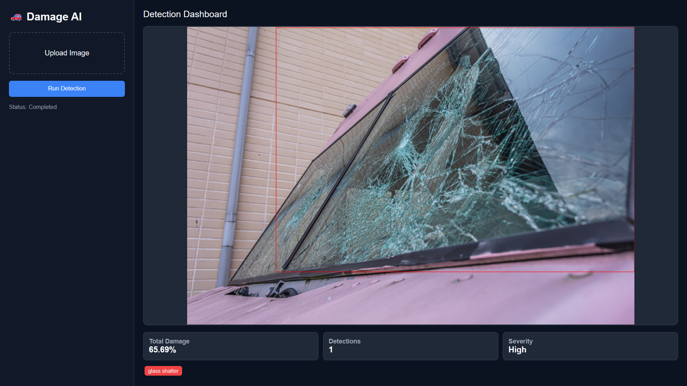

# 🚗 Car Damage Detection AI

A modern web application for identifying and assessing car damage using computer vision (YOLOv8) and a Flask backend.

 

## 🌟 Features

- **AI-Powered Detection**: Uses a fine-tuned YOLOv8 model to detect scratches, dents, and other damages.
- **Damage Assessment**: Automatically calculates the percentage of damage based on detection areas.
- **Modern Dashboard**: A clean, responsive dark-themed UI for uploading images and viewing results.
- **Docker Ready**: Fully containerized for easy deployment.

## 🛠️ Tech Stack

- **Backend**: Flask, Flask-CORS
- **Computer Vision**: Ultralytics YOLOv8, OpenCV, PyTorch
- **Frontend**: Vanilla HTML5, CSS3 (Modern Grid/Flexbox), JavaScript
- **Infrastructure**: Docker, Conda

## 🚀 Getting Started

### 1. Prerequisites
- [Anaconda](https://www.anaconda.com/) or [Miniconda](https://docs.conda.io/en/latest/miniconda.html)
- Python 3.10+

### 2. Setup Environment
Clone the repository and set up the environment:
```powershell
# Create the conda environment
conda env create -f environment.yml

# Activate the environment
conda activate car_damage_env
```

### 3. Run the Application
Start the Flask server from the project root:
```powershell
python -m backend.app.main
```
Open your browser to [http://127.0.0.1:8000](http://127.0.0.1:8000).

---

## 🐳 Docker Deployment

To build and run the application using Docker:
```powershell
docker build -t car-detection .
docker run -p 8000:8000 car-detection
```

## 🚀 Deployment

### Deploy to Render
The easiest way to deploy is using the provided `render.yaml` (Blueprints):

1.  Push your code to GitHub.
2.  Log in to [Render](https://render.com/).
3.  Click **New +** and select **Blueprint**.
4.  Connect your GitHub repository.
5.  Render will automatically detect the `render.yaml` and set up the **Docker** web service.

*Note: Due to the size of PyTorch, the first build may take 5-10 minutes. The Free tier (512MB RAM) is tight, but YOLOv8 Nano should fit.*

---

## 📂 Project Structure

- `backend/`: Flask application, routes, and inference services.
  - `models/`: Contains the trained `best.pt` YOLO model.
- `frontend/`: Web interface files (`index.html`).
- `samples/`: Sample images for testing the model.
- `Dockerfile`: Configuration for containerization.
- `requirements.txt`: Python dependencies.
- `environment.yml`: Conda environment configuration.

## 📝 License
This project is for educational and demonstration purposes.
